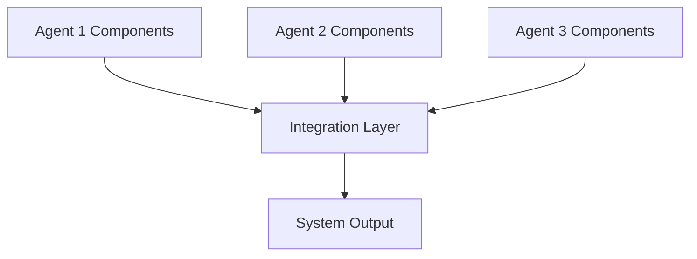

# PACT Coordination Phase: Integration Optimization Template

## Project Context
**Project Name**: [PROJECT_NAME]
**Current Phase**: Coordination - Integration and Optimization
**Agent Ecosystem**: [BRIEF_DESCRIPTION_OF_AGENTS]
**Integration Scope**: [WHAT_IS_BEING_INTEGRATED]

## Integration Coordination

### Component Integration Strategy
How agent-produced components are integrated into a cohesive system:

#### Integration Architecture


#### Integration Phases
1. **Component Validation**
   - **Validation Criteria**: [Standards each component must meet]
   - **Validation Process**: [How components are validated before integration]
   - **Responsible Agents**: [Who validates what]

2. **Interface Alignment**
   - **Interface Standards**: [Common interface definitions]
   - **Data Format Standardization**: [Unified data formats]
   - **Protocol Harmonization**: [Consistent communication protocols]

3. **System Assembly**
   - **Assembly Process**: [Step-by-step integration procedure]
   - **Dependency Resolution**: [Handling component dependencies]
   - **Configuration Management**: [Managing system configuration]

4. **Integration Testing**
   - **Test Strategy**: [How integrated system is tested]
   - **Validation Criteria**: [Success criteria for integration]
   - **Rollback Procedures**: [What to do if integration fails]

### Interface Standardization
Common interfaces and data formats between agent-produced components:

#### Data Exchange Standards
```json
{
  "standard_data_format": {
    "agent_id": "string",
    "component_type": "string", 
    "version": "string",
    "interface_specification": {},
    "data_schema": {},
    "validation_rules": []
  }
}
```

#### API Interface Standards
- **REST API Standards**: [Consistent REST API patterns]
- **Event-Driven Interfaces**: [Event format and handling standards]
- **Batch Processing Interfaces**: [Standards for batch data processing]
- **Real-Time Communication**: [WebSocket and real-time communication standards]

### Version Control Coordination
How agents coordinate code and documentation changes:

#### Branching Strategy
- **Agent Branches**: [How agents manage their development branches]
- **Integration Branches**: [Branches used for integration work]
- **Release Coordination**: [How releases are coordinated across agents]

#### Merge Coordination
- **Merge Protocols**: [Rules for merging agent contributions]
- **Conflict Resolution**: [Handling merge conflicts between agents]
- **Integration Validation**: [Validating merged changes]

#### Change Management
- **Change Notification**: [How agents notify others of changes]
- **Impact Assessment**: [Evaluating impact of changes on other agents]
- **Rollback Coordination**: [Coordinated rollback procedures]

## Collaboration Optimization

### Communication Efficiency
Optimizing information flow between agents:

#### Communication Analysis
- **Message Volume**: [Current: X messages/day, Target: Y messages/day]
- **Response Time**: [Current: X minutes, Target: Y minutes]
- **Information Relevance**: [Current: X% relevant, Target: Y% relevant]
- **Communication Overhead**: [Current: X% of time, Target: Y% of time]

#### Optimization Strategies
1. **Message Consolidation**: [Combining related messages]
2. **Smart Filtering**: [Filtering irrelevant communications]
3. **Context Caching**: [Reducing repeated context sharing]
4. **Asynchronous Coordination**: [Reducing synchronous communication needs]

### Decision-Making Enhancement
Improving collaborative decision processes:

#### Decision Categories
- **Technical Decisions**: [Architecture, technology choices, implementation approaches]
- **Process Decisions**: [Workflow changes, coordination improvements]
- **Resource Decisions**: [Resource allocation and prioritization]
- **Quality Decisions**: [Quality standards and validation approaches]

#### Decision-Making Optimization
1. **Decision Authority Clarification**: [Clear decision-making responsibilities]
2. **Information Aggregation**: [Efficient collection of decision-relevant information]
3. **Consensus Building**: [Efficient consensus-building mechanisms]
4. **Decision Documentation**: [Recording and communicating decisions]

### Knowledge Sharing Systems
Mechanisms for sharing learned insights across the agent ecosystem:

#### Knowledge Categories
- **Technical Knowledge**: [Code patterns, solutions, optimizations]
- **Process Knowledge**: [Effective coordination patterns, workflows]
- **Domain Knowledge**: [Business logic, requirements insights]
- **Quality Knowledge**: [Testing strategies, quality patterns]

#### Sharing Mechanisms
- **Knowledge Repository**: [Centralized knowledge storage and retrieval]
- **Learning Sessions**: [Structured knowledge sharing between agents]
- **Pattern Libraries**: [Reusable patterns and solutions]
- **Best Practice Documentation**: [Evolved best practices]

## System Coherence

### Architecture Validation
Ensuring overall system architecture remains coherent despite distributed development:

#### Coherence Criteria
- **Architectural Consistency**: [Adherence to architectural principles]
- **Design Pattern Consistency**: [Consistent use of design patterns]
- **Interface Compatibility**: [All interfaces work together properly]
- **Performance Coherence**: [System-wide performance remains acceptable]

#### Validation Mechanisms
1. **Architectural Reviews**: [Regular architecture validation sessions]
2. **Automated Coherence Checks**: [Automated tools for architecture validation]
3. **Integration Testing**: [Testing system coherence]
4. **Performance Profiling**: [System-wide performance analysis]

### Design Consistency
Maintaining consistent design patterns across agent contributions:

#### Design Standards
- **Code Style Standards**: [Consistent coding conventions]
- **Naming Conventions**: [Unified naming across components]
- **Documentation Standards**: [Consistent documentation formats]
- **Error Handling Patterns**: [Standardized error handling approaches]

#### Consistency Enforcement
- **Automated Style Checking**: [Tools for enforcing consistency]
- **Design Review Process**: [Manual review for design consistency]
- **Pattern Libraries**: [Shared libraries of approved patterns]
- **Refactoring Coordination**: [Coordinated efforts to improve consistency]

### Documentation Synchronization
Keeping all documentation aligned and current:

#### Documentation Types
- **API Documentation**: [Keeping API docs current with implementation]
- **Architecture Documentation**: [Maintaining up-to-date architecture docs]
- **Process Documentation**: [Current workflow and coordination procedures]
- **User Documentation**: [End-user documentation consistency]

#### Synchronization Mechanisms
1. **Auto-Generation**: [Documentation generated automatically from code]
2. **Change Triggers**: [Documentation updates triggered by code changes]
3. **Review Workflows**: [Documentation review and approval processes]
4. **Version Alignment**: [Ensuring documentation versions match code versions]

## Collective Intelligence

### Learning Systems
How the agent ecosystem learns and improves over time:

#### Learning Categories
- **Performance Learning**: [Optimizing performance based on experience]
- **Coordination Learning**: [Improving coordination based on outcomes]
- **Quality Learning**: [Enhancing quality based on feedback]
- **Process Learning**: [Evolving processes based on effectiveness]

#### Learning Mechanisms
1. **Experience Aggregation**: [Collecting and analyzing experiences]
2. **Pattern Recognition**: [Identifying successful patterns]
3. **Predictive Modeling**: [Predicting outcomes based on experience]
4. **Adaptive Algorithms**: [Self-improving coordination algorithms]

### Pattern Recognition
Identifying successful collaboration patterns:

#### Pattern Categories
- **Communication Patterns**: [Effective communication sequences]
- **Coordination Patterns**: [Successful coordination approaches]
- **Integration Patterns**: [Effective integration strategies]
- **Quality Patterns**: [Quality assurance patterns that work]

#### Pattern Evolution
1. **Pattern Detection**: [How successful patterns are identified]
2. **Pattern Validation**: [Confirming pattern effectiveness]
3. **Pattern Generalization**: [Making patterns reusable]
4. **Pattern Sharing**: [Distributing successful patterns]

### Best Practice Evolution
Developing and sharing improved practices:

#### Evolution Process
1. **Practice Identification**: [Identifying practices that work well]
2. **Effectiveness Measurement**: [Measuring practice effectiveness]
3. **Practice Refinement**: [Improving practices based on experience]
4. **Practice Standardization**: [Making practices reusable standards]
5. **Practice Distribution**: [Sharing practices across agent ecosystem]

## Coordination Metrics

### Efficiency Metrics
Measuring coordination effectiveness:

- **Coordination Overhead**: [Time spent on coordination vs. productive work]
- **Decision Speed**: [Time from issue identification to decision]
- **Information Flow Rate**: [Speed of information propagation]
- **Conflict Resolution Time**: [Average time to resolve coordination conflicts]

### Quality Metrics
Measuring collaborative quality:

- **Integration Success Rate**: [Percentage of successful integrations]
- **Consistency Score**: [Measurement of system-wide consistency]
- **Error Propagation Rate**: [How quickly errors are detected and contained]
- **Quality Improvement Rate**: [Rate of quality improvement over time]

### Collaboration Metrics
Measuring agent collaboration effectiveness:

- **Collaboration Frequency**: [How often agents collaborate]
- **Collaboration Quality**: [Effectiveness of collaborative efforts]
- **Knowledge Sharing Rate**: [Frequency and effectiveness of knowledge sharing]
- **Collective Problem Solving**: [Success rate of collaborative problem solving]

## Optimization Strategies

### Communication Optimization
- **Reduce Redundancy**: [Eliminate redundant communications]
- **Improve Relevance**: [Ensure communications are relevant to recipients]
- **Optimize Timing**: [Communicate at optimal times]
- **Enhance Clarity**: [Improve communication clarity and effectiveness]

### Coordination Optimization
- **Streamline Processes**: [Simplify coordination processes]
- **Automate Routine Coordination**: [Automate repetitive coordination tasks]
- **Improve Decision Making**: [Faster and better collaborative decisions]
- **Enhance Resource Utilization**: [More efficient use of shared resources]

### Integration Optimization
- **Reduce Integration Complexity**: [Simplify integration processes]
- **Improve Integration Reliability**: [Make integration more reliable]
- **Accelerate Integration Cycles**: [Faster integration iterations]
- **Enhance Integration Quality**: [Higher quality integration outcomes]

## Continuous Improvement

### Feedback Loops
Mechanisms for continuous coordination improvement:

1. **Performance Feedback**: [Regular performance assessment and improvement]
2. **Process Feedback**: [Coordination process effectiveness evaluation]
3. **Quality Feedback**: [Quality outcome analysis and improvement]
4. **User Feedback**: [End-user feedback on system behavior]

### Adaptation Mechanisms
How coordination adapts to changing conditions:

- **Dynamic Reconfiguration**: [Adjusting coordination based on performance]
- **Process Evolution**: [Evolving coordination processes over time]
- **Agent Role Adaptation**: [Adapting agent roles based on effectiveness]
- **Communication Pattern Evolution**: [Evolving communication patterns]

## Reflection

### Coordination Effectiveness Analysis
[Analyze how effectively the coordination phase achieved its objectives]

### Integration Success Assessment
[Evaluate the success of integrating agent contributions into a coherent system]

### Collaboration Quality Review
[Assess the quality of collaboration between agents]

### System Coherence Validation
[Validate that the system maintains coherence despite distributed development]

### Optimization Impact Assessment
[Evaluate the impact of optimization efforts on overall system performance]

### Learning and Adaptation Analysis
[Assess how well the system learned and adapted during coordination]

### Recommendations for Future Coordination
[Recommendations for improving coordination in future projects or phases]