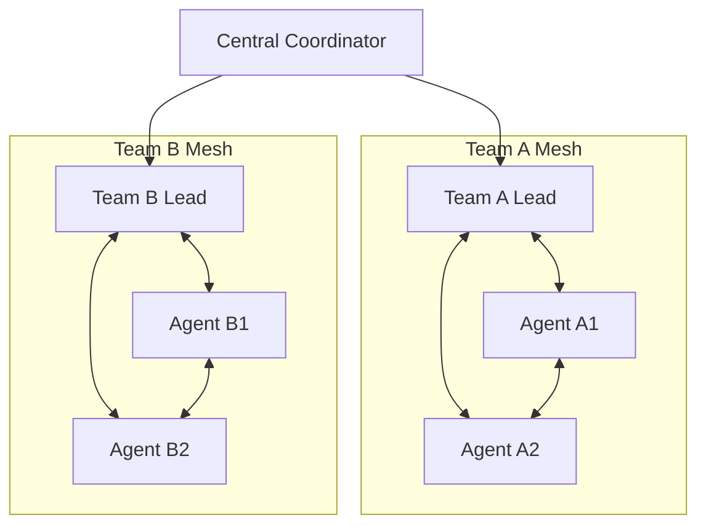

# PACT Planning Phase: Agent Ecosystem Template

## Project Context
**Project Name**: [PROJECT_NAME]
**Project Type**: [WEB_APP/MOBILE_APP/API/DESKTOP/OTHER]
**Complexity Level**: [LOW/MEDIUM/HIGH/ENTERPRISE]
**Expected Duration**: [TIMELINE]

## Agent Ecosystem Design

### Primary Agents
Define each agent that will participate in this project:

#### Agent 1: [AGENT_ROLE_NAME]
- **Primary Responsibilities**: 
  - [Responsibility 1]
  - [Responsibility 2]
  - [Responsibility N]
- **Core Capabilities**:
  - [Capability 1]
  - [Capability 2]
  - [Capability N]
- **Autonomy Level**: [HIGH/MEDIUM/LOW]
- **Decision Authority**: [What decisions this agent can make independently]
- **Escalation Triggers**: [When this agent must consult others]
- **Resource Access**: [What resources this agent can access directly]

#### Agent 2: [AGENT_ROLE_NAME]
[Repeat above structure for each agent]

### Agent Interaction Matrix

| From/To Agent | [Agent 1] | [Agent 2] | [Agent 3] | [Agent N] |
|---------------|-----------|-----------|-----------|-----------|
| [Agent 1]     | -         | [Type]    | [Type]    | [Type]    |
| [Agent 2]     | [Type]    | -         | [Type]    | [Type]    |
| [Agent 3]     | [Type]    | [Type]    | -         | [Type]    |
| [Agent N]     | [Type]    | [Type]    | [Type]    | -         |

**Interaction Types:**
- **Direct**: Agents communicate directly
- **Mediated**: Communication through coordination system
- **Broadcast**: One-to-many communication
- **None**: No direct communication needed

## Swarm Topology Design

### Topology Selection
Choose the fundamental coordination pattern that defines how agents interact and collaborate:

#### ⭐️ Star Topology
- **Structure**: Single central agent (hub) coordinates all others (spokes)
- **Management**: Hub assigns tasks, aggregates results, and enforces rules
- **Best For**:
  - Small swarms (3-5 agents)
  - Projects requiring strict oversight and control
  - Clear hierarchical decision-making needs
  - Simple coordination requirements
- **Strengths**:
  - Easy to control and monitor
  - Clear accountability and verification
  - Simplified communication patterns
  - Predictable behavior and outcomes
- **Weaknesses**:
  - Central point of failure
  - Hub becomes bottleneck under load
  - Limited scalability
  - Reduced agent autonomy
- **Implementation Pattern**:
  ```mermaid
  graph TD
      Hub[Coordinator Agent] --> A[Agent 1]
      Hub --> B[Agent 2]
      Hub --> C[Agent 3]
      Hub --> D[Agent N]
  ```

#### 🌟 Mesh Topology
- **Structure**: Agents communicate directly with each other in peer-to-peer fashion
- **Management**: Coordination emerges through local exchanges and negotiation
- **Best For**:
  - Medium to large swarms (4-12 agents)
  - Dynamic, adaptive tasks requiring flexibility
  - Distributed problem-solving scenarios
  - High resilience requirements
- **Strengths**:
  - High resilience - no single point of failure
  - Adaptive and self-organizing
  - Scales well with agent count
  - Preserves agent autonomy
- **Weaknesses**:
  - Harder to monitor globally
  - Risk of coordination drift
  - Complex consensus mechanisms needed
  - Potential communication overhead
- **Implementation Pattern**:
  ```mermaid
  graph LR
      A[Agent 1] <--> B[Agent 2]
      A <--> C[Agent 3]
      A <--> D[Agent 4]
      B <--> C
      B <--> D
      C <--> D
  ```

#### 🧠 Hive-Mind Topology
- **Structure**: Agents operate as parts of a collective organism with shared state
- **Management**: Shared memory and global state ensure synchronized behavior
- **Best For**:
  - Complex reasoning and analysis tasks
  - Large swarms (8+ agents) requiring coordination
  - Continuous learning and adaptation scenarios
  - High-level collaborative intelligence needs
- **Strengths**:
  - Emergent collective intelligence
  - High-level coordination capabilities
  - Shared learning and knowledge evolution
  - Sophisticated collaborative problem-solving
- **Weaknesses**:
  - High communication and coordination costs
  - Risk of runaway effects without proper guardrails
  - Complex state management requirements
  - Potential for groupthink behaviors
- **Implementation Pattern**:
  ```mermaid
  graph TB
      SS[Shared State/Memory]
      SS <--> A[Agent 1]
      SS <--> B[Agent 2]
      SS <--> C[Agent 3]
      SS <--> D[Agent N]
      A <--> B
      B <--> C
      C <--> A
  ```

### Hybrid Topology Strategies
Most effective systems layer these patterns based on system demands:

#### Hierarchical Hybrid (Star + Mesh)
- **Structure**: Star topology at high level with mesh clusters
- **Use Case**: Large projects with specialized sub-teams
- **Pattern**: Department/team leads in star, team members in mesh


#### Dynamic Topology
- **Structure**: Topology changes based on current phase or task requirements
- **Use Case**: Projects with varying coordination needs over time
- **Pattern**: Star for planning, Mesh for execution, Hive-mind for learning

### Topology Selection Criteria

#### Project Characteristics
- **Team Size**:
  - 1-3 agents: Star or simple Mesh
  - 4-7 agents: Mesh or Hierarchical Hybrid
  - 8+ agents: Hive-mind or Complex Hybrid
- **Complexity Level**:
  - Low: Star topology
  - Medium: Mesh topology
  - High: Hive-mind or Hybrid
- **Coordination Requirements**:
  - Strict control: Star
  - Adaptive coordination: Mesh
  - Collective intelligence: Hive-mind

#### Performance Requirements
- **Fault Tolerance**: Mesh or Hive-mind over Star
- **Scalability**: Mesh or Hive-mind over Star
- **Response Time**: Star for speed, Mesh for reliability
- **Resource Efficiency**: Star for minimal overhead

### Selected Topology
**Chosen Pattern**: [STAR/MESH/HIVE_MIND/HYBRID]

**Rationale**: [Explain why this topology was selected based on project characteristics, team size, complexity, and requirements]

**Implementation Strategy**:
- [Specific details on how the chosen topology will be implemented]
- [Communication patterns and protocols]
- [Coordination mechanisms and decision-making processes]
- [Monitoring and adaptation procedures]

## Task Decomposition Strategy

### High-Level Task Categories
1. **[TASK_CATEGORY_1]**
   - Primary Agent: [AGENT_NAME]
   - Supporting Agents: [LIST]
   - Dependencies: [OTHER_TASKS]
   - Coordination Points: [WHEN_COORDINATION_NEEDED]

2. **[TASK_CATEGORY_2]**
   - Primary Agent: [AGENT_NAME]
   - Supporting Agents: [LIST]
   - Dependencies: [OTHER_TASKS]
   - Coordination Points: [WHEN_COORDINATION_NEEDED]

### Task Assignment Logic
- **Capability-Based Assignment**: [How tasks are assigned based on agent capabilities]
- **Load Balancing Rules**: [How work is distributed to prevent overload]
- **Priority Handling**: [How urgent tasks are prioritized and assigned]
- **Conflict Resolution**: [What happens when multiple agents could handle a task]

### Task Dependencies


## Coordination Protocols

### Communication Standards
- **Message Format**: [Standardized format for inter-agent messages]
- **Communication Channels**: [How agents communicate - API, events, etc.]
- **Status Reporting**: [How and when agents report their status]
- **Context Sharing**: [How agents share relevant context information]

### Decision-Making Framework
1. **Individual Decisions**: [What each agent can decide alone]
2. **Collaborative Decisions**: [Decisions requiring multiple agents]
3. **Escalation Process**: [When and how to escalate decisions]
4. **Consensus Mechanisms**: [How agents reach agreement]
5. **Override Procedures**: [Emergency decision-making procedures]

### Conflict Resolution Procedures
1. **Identification**: [How conflicts are detected]
2. **Classification**: [Types of conflicts and their severity]
3. **Resolution Strategies**: [Approaches for different conflict types]
4. **Escalation Path**: [When human intervention is needed]
5. **Learning Integration**: [How resolutions improve future coordination]

## Resource Management

### Shared Resources
- **Databases**: [Which agents access which databases and how]
- **APIs**: [API access patterns and rate limiting]
- **Computational Resources**: [CPU, memory allocation strategies]
- **External Services**: [Third-party service coordination]

### Access Control Mechanisms
- **Permission Matrix**: [Who can access what resources]
- **Locking Strategies**: [Preventing resource conflicts]
- **Priority Systems**: [Resource access prioritization]
- **Monitoring**: [Tracking resource usage and conflicts]

### Load Balancing Strategy
- **Work Distribution**: [How work is distributed among agents]
- **Capacity Monitoring**: [Tracking agent capacity and performance]
- **Dynamic Reallocation**: [Adjusting work distribution based on performance]
- **Bottleneck Prevention**: [Strategies to prevent coordination bottlenecks]

## Coordination Quality Metrics

### Communication Effectiveness
- **Message Delivery Rate**: [Target: X% successful delivery]
- **Response Time**: [Target: X seconds for acknowledgments]
- **Context Accuracy**: [Target: X% of shared context is accurate]

### Decision Quality
- **Decision Speed**: [Target: X seconds for routine decisions]
- **Decision Accuracy**: [Target: X% of decisions are correct]
- **Conflict Resolution Time**: [Target: X minutes to resolve conflicts]

### Resource Utilization
- **Resource Efficiency**: [Target: X% utilization rate]
- **Contention Rate**: [Target: <X% of resource access conflicts]
- **Load Distribution**: [Target: X% balance across agents]

## Risk Assessment and Mitigation

### Coordination Risks
1. **Communication Failures**
   - **Risk**: [Description of risk]
   - **Probability**: [HIGH/MEDIUM/LOW]
   - **Impact**: [HIGH/MEDIUM/LOW]  
   - **Mitigation**: [Prevention and response strategies]

2. **Agent Overload**
   - **Risk**: [Description of risk]
   - **Probability**: [HIGH/MEDIUM/LOW]
   - **Impact**: [HIGH/MEDIUM/LOW]
   - **Mitigation**: [Prevention and response strategies]

3. **Resource Conflicts**
   - **Risk**: [Description of risk]
   - **Probability**: [HIGH/MEDIUM/LOW]
   - **Impact**: [HIGH/MEDIUM/LOW]
   - **Mitigation**: [Prevention and response strategies]

### Contingency Plans
- **Agent Failure**: [What happens if an agent becomes unavailable]
- **Communication Breakdown**: [Alternative communication strategies]
- **Resource Unavailability**: [Backup resource strategies]
- **Performance Degradation**: [Strategies for maintaining service quality]

## Implementation Timeline

### Phase 1: Foundation (Days 1-X)
- [ ] Establish agent roles and responsibilities
- [ ] Implement basic communication protocols
- [ ] Set up shared resources and access control
- [ ] Validate basic coordination mechanisms

### Phase 2: Integration (Days X-Y)  
- [ ] Implement task assignment logic
- [ ] Establish decision-making processes
- [ ] Create conflict resolution procedures
- [ ] Test coordination under normal load

### Phase 3: Optimization (Days Y-Z)
- [ ] Optimize communication efficiency
- [ ] Fine-tune load balancing
- [ ] Implement advanced coordination features
- [ ] Validate coordination under stress

### Phase 4: Production Readiness (Days Z-End)
- [ ] Complete performance testing
- [ ] Finalize monitoring and alerting
- [ ] Create operational procedures
- [ ] Document coordination patterns

## Success Criteria
- [ ] All agents can communicate effectively
- [ ] Task assignment works automatically
- [ ] Conflicts are resolved quickly
- [ ] Resource utilization is balanced
- [ ] System performs under expected load
- [ ] Quality metrics are met consistently

## Reflection

### Planning Decisions Rationale
[Explain why specific coordination approaches were chosen]

### Alternative Approaches Considered
[What other coordination strategies were considered and why they were rejected]

### Assumptions and Constraints
[Key assumptions made during planning and known constraints]

### Risk Mitigation Strategies
[How identified risks are being addressed]

### Future Adaptations
[How the coordination plan might evolve as the project progresses]

### Learning Opportunities
[What can be learned from this coordination approach for future projects]