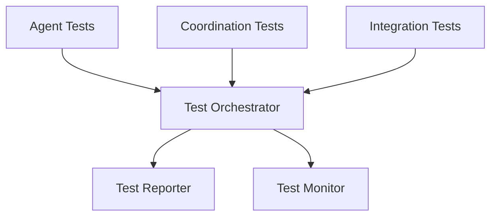

# PACT Testing Phase: Validation and Quality Assurance Template

## Project Context
**Project Name**: [PROJECT_NAME]
**Current Phase**: Testing - Multi-Agent Validation
**Agent Ecosystem**: [BRIEF_DESCRIPTION_OF_AGENTS]
**Testing Scope**: [WHAT_IS_BEING_TESTED]

## Multi-Agent Testing Strategy

### Individual Agent Testing
Comprehensive testing of each agent's contributions:

#### Agent 1: [AGENT_NAME] Testing
- **Unit Testing**: 
  - Test Coverage Target: [X%]
  - Key Test Categories: [LIST_TEST_TYPES]
  - Testing Tools: [TOOLS_USED]
  - Validation Criteria: [SUCCESS_CRITERIA]

- **Integration Testing**:
  - Interface Testing: [How agent's interfaces are tested]
  - Dependency Testing: [Testing agent's dependencies]
  - Contract Testing: [Validating contracts with other agents]

- **Performance Testing**:
  - Performance Metrics: [KEY_METRICS]
  - Load Testing: [LOAD_TEST_SCENARIOS]
  - Stress Testing: [STRESS_TEST_CONDITIONS]

#### Agent 2: [AGENT_NAME] Testing
[Repeat structure for each agent]

### Collaborative Behavior Testing
Testing agent interactions and coordination mechanisms:

#### Coordination Testing
- **Communication Testing**: [Validating inter-agent communication]
- **Decision-Making Testing**: [Testing collaborative decision processes]
- **Conflict Resolution Testing**: [Validating conflict resolution mechanisms]
- **Resource Sharing Testing**: [Testing shared resource coordination]

#### Workflow Testing
- **Sequential Workflows**: [Testing agent handoffs and dependencies]
- **Parallel Workflows**: [Testing simultaneous agent operations]
- **Dynamic Workflows**: [Testing adaptive workflow changes]
- **Error Recovery Workflows**: [Testing error handling and recovery]

#### Emergent Behavior Testing
- **System Emergent Properties**: [Testing system-level behaviors]
- **Adaptation Testing**: [Testing system adaptation capabilities]
- **Learning Validation**: [Validating agent learning mechanisms]
- **Scalability Testing**: [Testing coordination scalability]

### System Integration Testing
End-to-end system testing across all agent contributions:

#### Integration Test Categories
1. **Functional Integration**
   - **Feature Integration**: [Testing complete features across agents]
   - **User Journey Testing**: [End-to-end user experience validation]
   - **Business Process Testing**: [Complete business process validation]

2. **Non-Functional Integration**
   - **Performance Integration**: [System-wide performance testing]
   - **Security Integration**: [Comprehensive security testing]
   - **Reliability Integration**: [System reliability and availability testing]
   - **Scalability Integration**: [System scalability testing]

3. **Quality Integration**
   - **Code Quality**: [System-wide code quality metrics]
   - **Documentation Quality**: [Comprehensive documentation validation]
   - **User Experience Quality**: [End-to-end UX validation]

## Validation Framework

### Functional Validation
Comprehensive verification that all functional requirements are met:

#### Requirement Validation Matrix
| Requirement ID | Description | Primary Agent | Validation Method | Status |
|----------------|-------------|---------------|-------------------|---------|
| REQ-001 | [Description] | [Agent] | [Method] | [PASS/FAIL/PENDING] |
| REQ-002 | [Description] | [Agent] | [Method] | [PASS/FAIL/PENDING] |

#### User Scenario Validation
- **Happy Path Testing**: [Testing optimal user scenarios]
- **Edge Case Testing**: [Testing boundary conditions and edge cases]
- **Error Scenario Testing**: [Testing error handling and recovery]
- **Integration Scenario Testing**: [Testing scenarios that span multiple agents]

### Non-Functional Validation
Validation of performance, security, usability, and other non-functional aspects:

#### Performance Validation
- **Response Time Testing**:
  - Target: [X ms for Y% of requests]
  - Test Method: [HOW_MEASURED]
  - Validation Agents: [RESPONSIBLE_AGENTS]

- **Throughput Testing**:
  - Target: [X requests per second]
  - Test Method: [HOW_MEASURED]
  - Validation Agents: [RESPONSIBLE_AGENTS]

- **Scalability Testing**:
  - Target: [System scales to X concurrent users]
  - Test Method: [HOW_MEASURED]
  - Validation Agents: [RESPONSIBLE_AGENTS]

#### Security Validation
- **Authentication Testing**: [Validating authentication mechanisms]
- **Authorization Testing**: [Testing access controls]
- **Data Protection Testing**: [Validating data security measures]
- **Vulnerability Testing**: [Security vulnerability assessments]

##### AI Pentest Methodology for Agentic Systems
Comprehensive security testing methodology specifically designed for agentic systems and AI applications:

**System Inputs Context Testing**
- **Hardware Specifications Validation**: [Testing system performance under various hardware constraints]
- **Runtime Configuration Security**: [Validating secure configuration management and runtime parameters]
- **Resource Management Security**: [Testing resource allocation, memory management, and computational resource security]

**Ecosystem Context Testing**
- **Environment Awareness Security**: [Testing security in different deployment environments]
- **Integration Security Testing**: [Validating secure integrations with external systems and APIs]
- **Security Requirements Compliance**: [Ensuring compliance with security frameworks and standards]

**Model Context Testing**
- **Model Architecture Security**: [Testing for model vulnerabilities and architectural weaknesses]
- **Model Capabilities Assessment**: [Validating model behavior within security boundaries]
- **Behavioral Parameters Testing**: [Testing model responses under various security-relevant scenarios]

**Prompt Engineering Security Testing**
- **Dynamic Prompt Construction Security**: [Testing for prompt injection and manipulation vulnerabilities]
- **Prompt Optimization Security**: [Ensuring optimization processes don't introduce security vulnerabilities]
- **Input Sanitization Testing**: [Validating prompt input filtering and sanitization mechanisms]

**Data Context Security Testing**
- **Training Data Security Assessment**: [Evaluating training data for security implications and biases]
- **Real-time Input Validation**: [Testing security of real-time data inputs and processing]
- **Data Pipeline Security**: [Validating security throughout data processing pipelines]

**Application Context Security Testing**
- **Business Logic Security**: [Testing business logic for security flaws and edge cases]
- **User Interaction Security**: [Validating secure user interaction patterns and access controls]
- **Domain-specific Security Requirements**: [Testing security requirements specific to the application domain]

**Pivoting Context Security Testing**
- **Adaptive Behavior Security**: [Testing security implications of adaptive and learning behaviors]
- **Fallback Strategy Security**: [Validating security of fallback and error handling mechanisms]
- **Dynamic Reconfiguration Security**: [Testing security during system reconfiguration and updates]

#### Usability Validation
- **User Interface Testing**: [UI consistency and usability]
- **User Experience Testing**: [End-to-end UX validation]
- **Accessibility Testing**: [Accessibility compliance validation]
- **Documentation Testing**: [User documentation usability]

### Agent Coordination Validation
Verifying coordination mechanisms work correctly:

#### Coordination Test Categories
1. **Communication Validation**
   - **Message Delivery**: [100% critical messages delivered]
   - **Message Integrity**: [Messages received intact]
   - **Communication Latency**: [Target: <X ms communication delay]

2. **Decision-Making Validation**
   - **Decision Accuracy**: [X% of collaborative decisions are correct]
   - **Decision Speed**: [Average decision time <X minutes]
   - **Consensus Quality**: [Quality of consensus-building processes]

3. **Resource Coordination Validation**
   - **Resource Access**: [No unauthorized resource access]
   - **Resource Contention**: [<X% of time waiting for resources]
   - **Load Distribution**: [±X% variation in agent workload]

4. **Error Handling Validation**
   - **Error Detection**: [X% of errors detected automatically]
   - **Error Recovery**: [X% of errors recovered without human intervention]
   - **Error Communication**: [100% of critical errors communicated]

## Test Automation

### Automated Test Suites
Comprehensive automated testing systems for agentic development:

#### Test Automation Architecture

#### Test Categories
1. **Unit Test Automation**
   - **Agent Unit Tests**: [Automated testing of individual agent functions]
   - **Component Unit Tests**: [Testing agent-produced components]
   - **Interface Unit Tests**: [Testing agent interfaces]

2. **Integration Test Automation**
   - **Agent Integration Tests**: [Automated testing of agent interactions]
   - **System Integration Tests**: [Automated end-to-end testing]
   - **API Integration Tests**: [Automated API testing]

3. **Coordination Test Automation**
   - **Communication Tests**: [Automated testing of agent communication]
   - **Workflow Tests**: [Automated testing of coordination workflows]
   - **Load Tests**: [Automated testing under various loads]

### Continuous Testing
Ongoing testing throughout the development process:

#### Continuous Testing Pipeline
1. **Code Commit Triggers**: [Tests triggered by code commits]
2. **Integration Triggers**: [Tests triggered by integration events]
3. **Scheduled Testing**: [Regular automated test execution]
4. **Performance Monitoring**: [Continuous performance validation]

#### Test Feedback Loops
- **Immediate Feedback**: [Real-time test results to agents]
- **Trend Analysis**: [Analysis of test results over time]
- **Quality Metrics**: [Continuous quality metric tracking]
- **Improvement Suggestions**: [Automated suggestions for improvement]

### Agent-Generated Tests
Tests created by agents for agent-produced code:

#### Test Generation Strategy
- **Automatic Test Generation**: [How agents automatically generate tests]
- **Test Case Coverage**: [Ensuring comprehensive test coverage]
- **Test Quality Validation**: [Validating the quality of agent-generated tests]
- **Test Maintenance**: [How agents maintain and update tests]

#### Test Validation
- **Test Effectiveness**: [Measuring how well agent-generated tests work]
- **Test Coverage Analysis**: [Analyzing test coverage across agent contributions]
- **Test Quality Metrics**: [Metrics for agent-generated test quality]

## Quality Metrics

### Code Quality Metrics
Metrics for code quality across agent contributions:

#### Individual Agent Code Quality
- **Code Complexity**: [Target: Cyclomatic complexity <X]
- **Code Coverage**: [Target: >X% test coverage]
- **Code Duplication**: [Target: <X% duplicate code]
- **Code Style Compliance**: [Target: >X% style compliance]

#### Collaborative Code Quality
- **Interface Consistency**: [Target: >X% interface consistency]
- **Integration Complexity**: [Target: <X integration complexity score]
- **Cross-Agent Dependencies**: [Target: <X dependencies per component]
- **System Cohesion**: [Target: >X cohesion score]

### Collaboration Quality Metrics
Metrics for agent coordination effectiveness:

#### Communication Quality
- **Message Clarity**: [Target: >X% messages understood correctly]
- **Communication Efficiency**: [Target: <X% communication overhead]
- **Response Timeliness**: [Target: >X% responses within SLA]

#### Decision Quality
- **Decision Accuracy**: [Target: >X% decisions prove correct]
- **Decision Speed**: [Target: <X minutes average decision time]
- **Consensus Quality**: [Target: >X% decisions reach consensus]

#### Coordination Quality
- **Task Coordination Success**: [Target: >X% tasks coordinated successfully]
- **Resource Utilization**: [Target: >X% efficient resource use]
- **Conflict Resolution**: [Target: <X average conflicts per day]

### System Quality Metrics
Overall system performance and reliability metrics:

#### Performance Metrics
- **System Response Time**: [Target: <X ms for Y% of requests]
- **System Throughput**: [Target: >X requests per second]
- **System Availability**: [Target: >X% uptime]
- **Error Rate**: [Target: <X% error rate]

#### Reliability Metrics
- **Mean Time Between Failures**: [Target: >X hours]
- **Mean Time to Recovery**: [Target: <X minutes]
- **Data Consistency**: [Target: >X% data consistency]
- **Backup and Recovery**: [Target: <X minutes recovery time]

## Test Execution Plan

### Testing Phases
Structured approach to testing execution:

#### Phase 1: Agent Validation (Days 1-X)
- [ ] Complete individual agent unit testing
- [ ] Validate agent interfaces and contracts
- [ ] Perform agent performance testing
- [ ] Document agent-specific test results

#### Phase 2: Coordination Testing (Days X-Y)
- [ ] Test agent communication mechanisms  
- [ ] Validate coordination workflows
- [ ] Test conflict resolution procedures
- [ ] Validate resource sharing mechanisms

#### Phase 3: Integration Testing (Days Y-Z)
- [ ] Perform system integration testing
- [ ] Validate end-to-end user scenarios
- [ ] Test system under various loads
- [ ] Validate system coherence and consistency

#### Phase 4: System Validation (Days Z-End)
- [ ] Complete performance and scalability testing
- [ ] Perform comprehensive security testing
- [ ] Validate all quality metrics
- [ ] Complete user acceptance testing

### Test Environment Management
- **Test Environment Setup**: [How test environments are configured]
- **Test Data Management**: [Managing test data across agents]
- **Environment Coordination**: [Coordinating test environment access]
- **Environment Cleanup**: [Maintaining clean test environments]

## Quality Gates

### Testing Quality Gates
Mandatory validation checkpoints:

#### Gate 1: Agent Validation Complete
- **Criteria**: [All individual agent tests pass]
- **Validation**: [How completion is verified]
- **Approval**: [Who approves gate passage]

#### Gate 2: Coordination Validation Complete  
- **Criteria**: [All coordination tests pass]
- **Validation**: [How coordination effectiveness is verified]
- **Approval**: [Who approves coordination quality]

#### Gate 3: Integration Validation Complete
- **Criteria**: [All integration tests pass]
- **Validation**: [How integration success is verified]
- **Approval**: [Who approves integration quality]

#### Gate 4: System Validation Complete
- **Criteria**: [All system-level tests pass]
- **Validation**: [How system quality is verified]
- **Approval**: [Who approves final system quality]

## Issue Management

### Test Issue Categories
- **Agent Issues**: [Issues with individual agent functionality]
- **Coordination Issues**: [Issues with agent coordination]
- **Integration Issues**: [Issues with system integration]
- **Performance Issues**: [System performance problems]
- **Quality Issues**: [Quality standard violations]

### Issue Resolution Process
1. **Issue Detection**: [How issues are identified during testing]
2. **Issue Classification**: [Categorizing and prioritizing issues]
3. **Agent Assignment**: [Assigning issues to appropriate agents]
4. **Resolution Coordination**: [Coordinating issue resolution efforts]
5. **Validation**: [Verifying issue resolution]
6. **Learning Integration**: [Learning from issues for prevention]

## Test Documentation

### Test Plans
- **Master Test Plan**: [Overall testing strategy and approach]
- **Agent-Specific Test Plans**: [Detailed test plans for each agent]
- **Integration Test Plan**: [Plan for integration testing]
- **Performance Test Plan**: [Plan for performance validation]

### Test Results Documentation
- **Test Execution Reports**: [Detailed results of test execution]
- **Quality Metrics Reports**: [Comprehensive quality metrics]
- **Issue Reports**: [Documentation of issues found and resolved]
- **Test Coverage Reports**: [Analysis of test coverage achieved]

### Test Artifacts
- **Test Cases**: [Comprehensive test case documentation]
- **Test Scripts**: [Automated test scripts and tools]
- **Test Data**: [Test data sets and management procedures]
- **Test Environment Documentation**: [Test environment configurations]

## Reflection

### Testing Completeness Assessment
[Evaluate whether testing was comprehensive enough to validate system quality]

### Agent Testing Effectiveness Analysis
[Analyze how effective individual agent testing was]

### Coordination Validation Success
[Assess how well coordination mechanisms were validated]

### Integration Testing Quality Review
[Review the effectiveness of integration testing approaches]

### Quality Metrics Achievement
[Evaluate whether quality metrics targets were achieved]

### Test Automation Effectiveness
[Assess the effectiveness of test automation strategies]

### Issue Resolution Analysis
[Analyze the effectiveness of issue detection and resolution]

### Recommendations for Future Testing
[Recommendations for improving testing in future agentic projects]

### Testing Framework Evolution
[How the testing framework should evolve based on learnings]